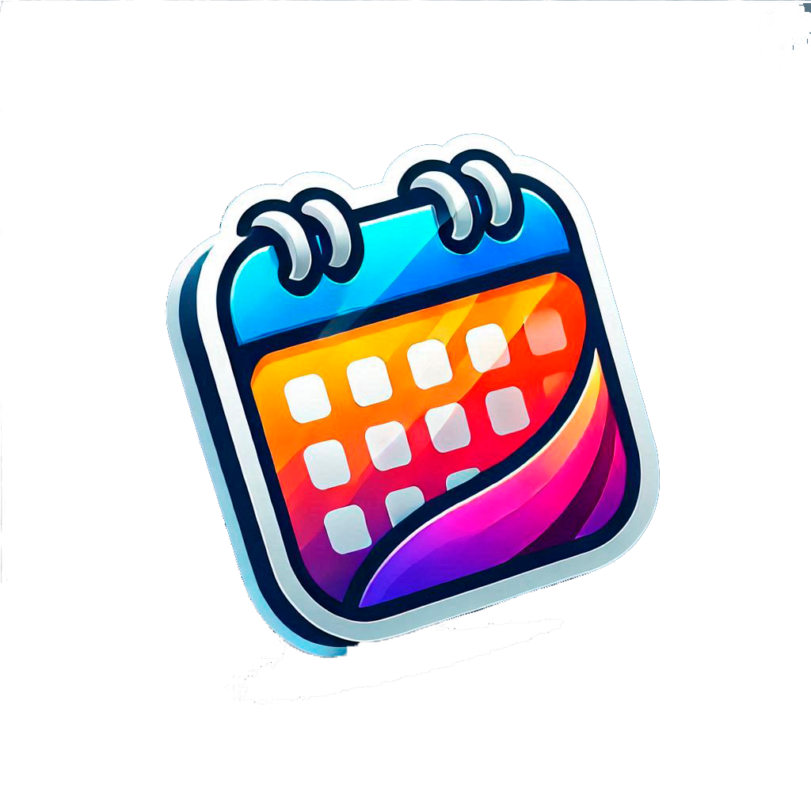
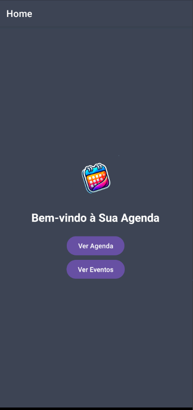
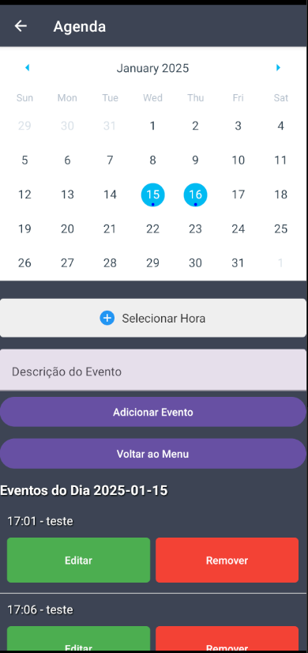
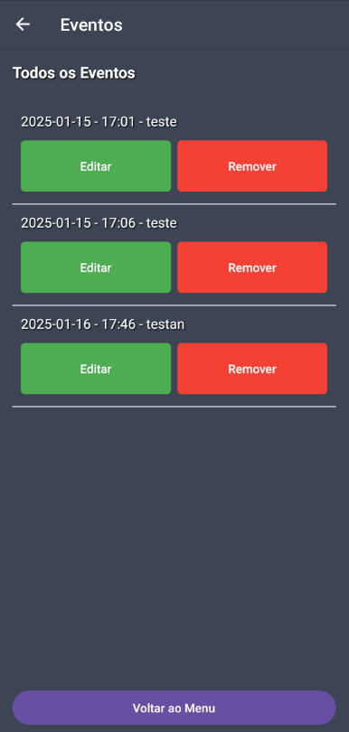

<h3 align = "center" fontSize="60px">
 App Agenda
</h3>
<p align="center">
  
</p>
<table>
  <tr>
    <td></td>
    <td></td>
    <td></td>
  </tr>
</table>

# App Agenda

Este é um aplicativo simples de agenda, desenvolvido com React Native e utilizando Expo, AsyncStorage, UUID. O app permite que os usuários registrem e visualizem eventos, e oferece funcionalidades para editar e remover eventos salvos.

## 🚀 Tecnologias Utilizadas

-   
  Utilizado para desenvolver o aplicativo móvel, permitindo a criação de interfaces nativas para Android e iOS utilizando JavaScript e React.

-   
  Plataforma que facilita o desenvolvimento de aplicativos React Native, proporcionando um ambiente de desenvolvimento rápido e integrado, com recursos como visualização em tempo real.

-   
  Utilizado para armazenar dados localmente no dispositivo, permitindo a persistência dos eventos mesmo após o fechamento do aplicativo.

-   
  Biblioteca usada para gerar identificadores exclusivos para os eventos, garantindo que cada entrada na agenda tenha um identificador único.

-   
  Utilizado para agendar e gerenciar notificações push no aplicativo, permitindo que os usuários recebam lembretes sobre os eventos agendados.

# 🎨 Funcionalidades

- Adicionar Eventos: O usuário pode adicionar eventos à agenda, especificando data, hora e descrição quais retornaram uma notificação.
- Editar Eventos: O usuário pode editar informações de eventos previamente salvos.
- Remover Eventos: O usuário pode remover eventos da agenda.
- Exibição de Eventos: Os eventos são listados de forma cronológica, com suas respectivas informações.

## 🛠️ Como Rodar o Projeto Localmente

1. Clone o repositório:

```bash
   git clone https://github.com/Sub-Dev/agenda-react-native.git

```

2. Acesse o diretório do projeto:

```bash
cd agenda-react-native
```

3. Instale as dependências:

```bash
 npm install
```

4. Executar o aplicativo
   Para rodar o aplicativo no ambiente de desenvolvimento, utilize o comando abaixo:

```bash
 npx expo start
```

Isso abrirá o Expo Developer Tools no navegador, onde você pode executar o aplicativo em um emulador de dispositivo ou em um dispositivo físico utilizando o aplicativo Expo Go.

## 👥 Autor

<table>
 <tr>
 <td alinhar="centro">
 <a href="https://github.com/Sub-Dev" target="_blank">
 
 </a>
 </td>
 <td>
 <strong>Anthony Marin</strong> (Sub-Dev) - <a href="https://github.com/Sub-Dev">Perfil no GitHub</a>
 </td>
 </tr>
</table>

## 📝 Licença

Este projeto está licenciado sob a licença MIT. Consulte o arquivo LICENSE para mais informações.
